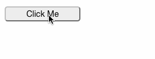

# ${pkg.name}

${badge('npm')} ${badge('license')} ${badge('github-issues')}

${pkg.description}



## Install

`npm install --save-dev ${pkg.name}`

## Usage

```html
<AsyncButton url={ url } onSuccess={ this.onSuccess }/>
```

See [examples](./examples)

## Scripts  

${scripts()}

## Dependencies

${dependencies()}

## Contributing

Contributions welcome; Please submit all pull requests the against master branch. If your pull request contains JavaScript patches or features, you should include relevant unit tests. Please check the [Contributing Guidelines](contributng.md) for more details. Thanks!

## Author

${pkg.author.name} <${pkg.author.email}> ${pkg.author.url}

## License

${license()}
